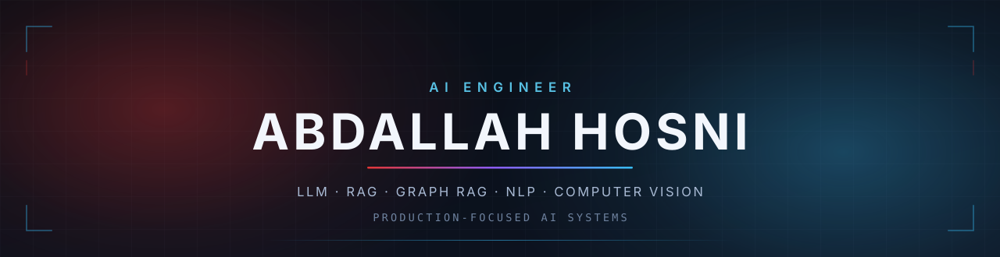
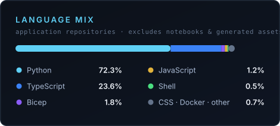

 

**AI Engineer & Full-Stack Developer — Egypt**

I build AI systems that are meant to survive contact with real users: guardrailed, tested, documented, and deployed.

---

### The problem I work on

Most AI demos break the moment they meet production. A model that answers well in a notebook still has to be constrained, validated, monitored, and made safe to run against real data.

That gap is my work. I treat model output as untrusted input, put an explicit boundary in front of it, and make the system prove itself with tests before it ships.

### What I'm building right now

- Guardrailed **text-to-SQL** — AST-level SQL validation instead of keyword filters
- **Graph RAG** and knowledge-graph retrieval over messy, real-world records
- **Bilingual (Arabic / English)** NLP pipelines
- Agentic workflows with **bounded, auditable** tool use

---

## Selected work

### [safe-text-to-sql](https://github.com/Abdo1119/safe-text-to-sql) &nbsp;·&nbsp; [Live demo](https://safe-text-to-sql-jopyjpvxd2y2cgvhv63zrn.streamlit.app/)

Natural-language analytics over a SQL database, built so that model-generated SQL can never be trusted blindly.

Generated SQL is parsed into an AST and checked by policy — single read-only statement, schema allowlist, no mutations, no data-modifying CTEs, no system catalogs, enforced row limits — then executed through a read-only connection with a fail-closed authorizer. Ships with a deterministic offline provider so the whole pipeline runs, and is tested, without any API key.

`Python` `Gemini` `SQLGlot` `Streamlit` `Docker` `pytest` · 184 offline tests · CI green · MIT

### [airport-lost-found-ai](https://github.com/Abdo1119/airport-lost-found-ai)

Bilingual, human-in-the-loop lost-item matching for airport operations — explainable scoring, Graph RAG, and image matching, with a complete local demo mode.

Built as a full production-shaped system rather than a notebook: API, database, cache, typed frontend, containers, and infrastructure definitions.

`Python` `FastAPI` `PostgreSQL` `Redis` `Graph RAG` `Computer Vision` `React` `TypeScript` `Docker` `Azure` · MIT

---

## Stack

**AI & ML**
 

**Backend & Data**
 

**Interfaces**
 

 

---

## Off-duty

Big Marvel fan — less for the capes, more for the workshop scenes. The appeal was never the suit; it was someone building, testing, and iterating until the thing actually held up under load.

That's the same instinct I bring to engineering: **build it, then try hard to break it before anyone else does.**

Outside that: chess, football, and reading about how large systems fail.

---

## Contact

<!-- Add your LinkedIn once ready, then uncomment:

-->

Open to AI engineering roles and freelance work on production LLM, RAG, and computer-vision systems.

 
<i>Model output is untrusted input until something proves otherwise.</i>

